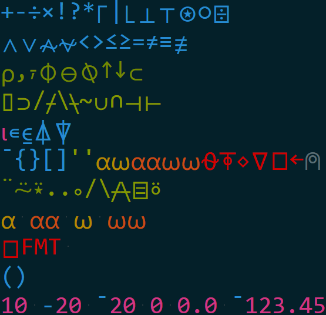

sublime-apl
===========

SublimeText highlighter for "A Programming Language" (APL)

Show me!
--------

| Go from                                                                             | To                                                                        |
|-------------------------------------------------------------------------------------|---------------------------------------------------------------------------|
|  |  |

Is it thorough?
---------------

Sublime-APL covers the complete APL language with a well balanced coloring scheme, including Dyalog and APL2 extensions.

Plugin installation
-------------------

`Package Control` is the easiest way to install this highlighter, and will manage version changes over time.

To install through Package Control:

* Bring up the command list (`ctrl-shift-P`) and type install package, which should bring up `Package Control: Install Package`. Package Control will pause briefly to fetch the list of available plugins.

  * If you don't see `Package Control: Install Package`, you need to install [Package Control](https://github.com/wbond/sublime_package_control) first.

* When the plugin list appears, type `apl`.  When you see this package, choose it.

Current Library Status: *Usable*
--------------------------------

This library is considered to be ready and usable, and is available in `Package Control`.

Improvements will be gladly accepted.

Author
------

* [John Haugeland](mailto:stonecypher@gmail.com) of [http://fullof.bs/](http://fullof.bs/).

Copyright
---------

Copyright (c) 2014 John Haugeland.  All rights reserved.

Thanks
------

Thanks to:

  * [FichteFoll](http://github.com/FichteFoll/) for help with string notation

Polemic :neckbeard:
===================

`sublime-apl` is MIT licensed, because viral licenses and newspeak language modification are evil. Free is ***only*** free when it's free for everyone.