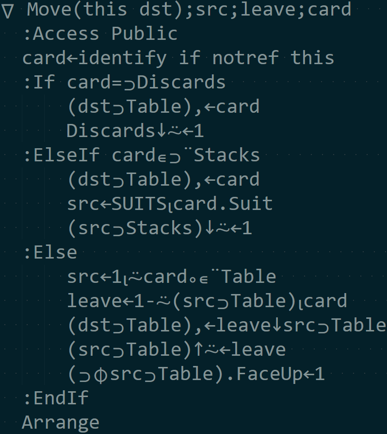
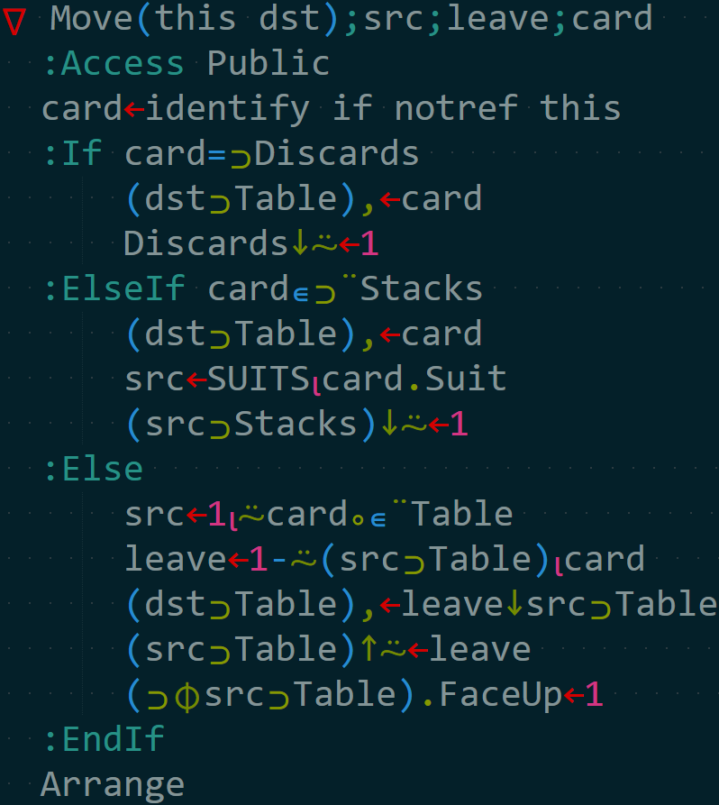

sublime-apl
===========

SublimeText highlighter for "A Programming Language" (APL)

Show me!
--------

Go from

to

Sublime-APL covers the complete APL language with a well balanced 
coloring scheme.

Thanks
------

Thanks to:

  * [FichteFoll](http://github.com/FichteFoll/) for help with string notation